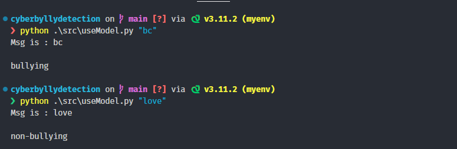

# How to run

Need python install

```bash


git clone https://github.com/TheSwordBreaker/fight-cyberbully-with-hindi-english-code-text-approch.git


pip install -r requirements.txt

```

## using env in windows

```bash


git clone https://github.com/TheSwordBreaker/fight-cyberbully-with-hindi-english-code-text-approch.git


python -m venv myenv

.\myenv\Scripts\activate

pip install -r requirements.txt

```

result :-


